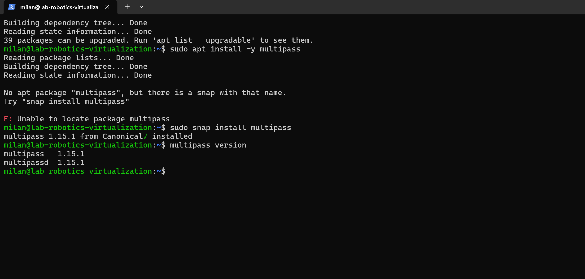
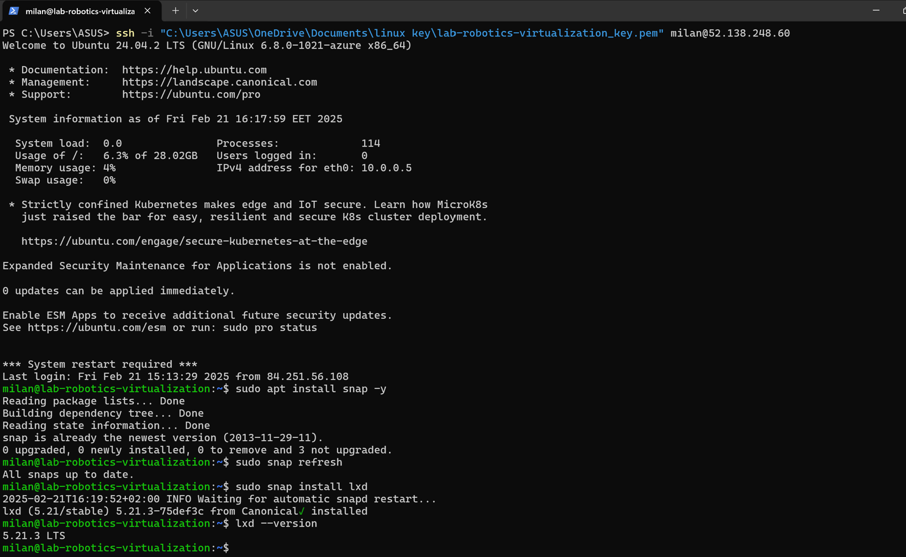
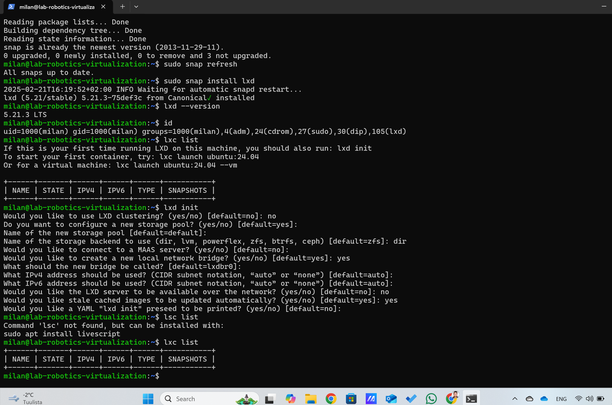

# Linux Virtualization Exercise ( Assignment - 7 )

## Student
**Milan Khadka**  
Class ID: **BEIRP24A6**

## Content
- **New virtual machine with Nested Virtualization: Support***
- **Part 1: Introduction to virtualization concepts**
- **Part 2: Working with Multipass**
- **Part 3: Exploring LXD**
- **Part 4: How to Stick Apps with Docker**
- **Part 5: Snaps for Self-Contained Applications**


# New Virtual Machine and Ubuntu 24.04.2LTS 

 In order to enable nested virtualization, the machine must support passthrough for virtualization hardware. This requires machine sizes slightly more powerful than the virtual machine we have been using in class. The following are the specifications of the computer we used to create a secondary computer:

 ### Dsv4 series - (Standard_D2s_v4)

| Size Name        | vCPUs (Qty.) |   Memory (GB)  |
|------------------|--------------|----------------|
| Standard D2s_v4   |      2      | 8              |

### Feature support:
- Premium Storage: Not Supported
- Premium Storage caching: Not Supported
- Live Migration: Supported
- Memory Preserving Updates: Supported
- VM Generation Support: Generation 1 and 2
- Accelerated Networking: Supported
- Ephemeral OS Disks: Not Supported
- ***Nested Virtualization: Supported***

 ### A new virtual machine that support nested virtualization is created with the help of Virtualization demos - class held on 13.2.2025 and i used Ubuntu 24.04.2 LTS over the whole exercise.

 ### Image of new machine in Microsoft Azure:
 

### Image of new machine in PowerShell: (Ubuntu 24.04.2 LTS )
 


# Part 1: Introduction to virtualization concepts:
***Virtualization is a technology that allows us to create multiple simulated environments or dedicated resources from a single physical hardware system. It enables efficient utilization of hardware resources by dividing a single physical machine into multiple virtual environments, each capable of running its own operating system and applications.***

## Key Concepts:
### 1. Virtualization:
Virtualization is the process of creating a virtual version of something, such as a server, storage device, network, or even an operating system. It allows multiple operating systems to run on a single physical machine, sharing the underlying hardware resources.

### 2. Hypervisor:
A hypervisor, also known as a Virtual Machine Monitor (VMM), is a software layer that enables virtualization. It sits between the physical hardware and the virtual machines (VMs), managing the allocation of resources to each VM. There are two types of hypervisors:

- Type 1 (Bare-metal): Runs directly on the host's hardware (e.g., VMware ESXi, Microsoft Hyper-V).

- Type 2 (Hosted): Runs on top of a conventional operating system (e.g., Oracle VirtualBox, VMware Workstation).

### 3. Virtual Machines (VMs):

A Virtual Machine (VM) is an emulation of a computer system. It runs an operating system and applications just like a physical computer but is isolated from the underlying hardware. Each VM includes a full copy of an operating system, the application, necessary binaries, and libraries, making it relatively large and resource-intensive. In another word a virtual machine (VM) is a software-based emulation of a physical computer. VMs run on a hypervisor and have their own operating system, applications, and dependencies. They provide the same functionality as physical computers but are isolated from each other.

### 4. Containers:
Containers are lightweight, portable, and self-sufficient units that package up code and all its dependencies so the application runs quickly and reliably from one computing environment to another. Unlike VMs, containers share the host system's operating system kernel and isolate the application processes from the rest of the system. This makes them more efficient in terms of resource usage.

### The main differences between VMs and Containers:

| Aspect   | Virtual Machines (VMs) |   Containers  |
|------------------|--------------|---------------- |
|   Architecture   |Each VM includes a full OS, making them heavier.      | Containers share the host OS kernel, making them lighter                                 |
|Resource Utilization| VMs are resource-intensive due to the need for a full OS.|Containers are more efficient as they share the host OS.                              |
|Insulation Levels|VMs provide strong isolation as each VM runs its own OS.|Containers offer less isolation since they share the OS kernel.                            |


# Part 2: Working with Multipass:
**Multipass is a lightweight tool or command-line tool for creating and managing Ubuntu virtual machines (VMs) on our local machine. It is designed to be simple and fast, making it ideal for developers who need to spin up Ubuntu environments quickly.**

# 1. Installation:

To install Multipass, i followed the instructions on the official website.

###   Links
[Multipass Installation Guide](https://canonical.com/multipass/docs)

#### There are two methods for installation of multipass and i chosed first one.
- Using Snap.

```sudo snap install multipass```
- Using APT.
```
sudo apt update
sudo apt install -y multipass
```

- Verify Installation:
Run the following command in the terminal.
 ```multipass version```
- Output:




# 2. Basic Commands:
Once i installed, i become able to use **multipass** command-line interface to manage Ubuntu instances. Here are basic commands i practice:

| Command                      | Description                                                       |  
|------------------------------|-------------------------------------------------------------------|
|**multipass launch**          | Launches a new Ubuntu instance (default or with a specific image).| 
|**multipass list**            | Lists all running instances and their status.                     |
|**multipass info <instance>** | Displays detailed information about a specific instance.          |
|**multipass shell <instance>**|Opens a shell session into the specified instance.                 |
|**multipass exec <instance> -- <command>**| Runs a command inside the specified instance.         |
|**multipass stop <instance>**  |Stops a running instance.                                         |
|**multipass delete <instance>**|Deletes an instance (use --purge to also remove its data).        |
|**multipass purge**            |Cleans up all deleted instances and their data.                   |

## I practice the following commands to get familiar with Multipass.

### 1. To Launch the default Ubuntu instance:
```multipass launch --name milan-vm```
- This create a new Ubuntu VM named milan-vm.

### 2. To List all running instances:
```multipass list```
- Displays all active and stopped instances.

### 3. To View details about a specific instance:
```multipass info milan-vm```
- This Shows details like IP address, state, and disk usage for the instance milan-vm.

### 4. To Access the shell of a running instance:
```multipass shell milan-vm```
-  This Opens a shell inside the milan-vm instance.

### 5. Run a command on the instance:
```multipass exec milan-vm -- lsb_release -a```
- Runs the ```lsb_release -a``` command on the ```milan-vm``` instance to display Ubuntu version details.

### 6. To Stop a running instance:
```multipass stop milan-vm```
- This stops the ```milan-vm``` instance.

### 7. To delete an instance:
```
multipass delete milan-vm
multipass purge
```
- This Deletes the ```milan-vm``` instance and purge removes all associated data.

### **Some screenshot while practicing are as follows :**


# 3. Exploring Cloud-init:
- Cloud-init is a tool for customizing cloud instances during initialization. We can use it to configure Multipass VMs.

## Study:
- I read the cloud-init documentation to understand its capabilities.
- Links

    [cloud-init documentation ](https://cloud-init.io/)


- After studies i figure out that Cloud-init is a set of scripts and utilities used to automate the initialization of cloud instances. It allows ws to customize the environment when launching our virtual machines.


## Experiment with Cloud-init:

### 1. I created a cloud-init.yaml file to customize our VM. 
**cloud-init.yaml** is a configuration file written in YAML format. It allows us to:
- Install packages.
- Create users.
- Run commands.
- Configure the system (e.g., network, SSH keys, etc.).

** To create cloud-init.yaml file first i open the powershell and opened a text editor nano. Then i added the desired configuration in YAML format. Below is an example:
```
# cloud-init.yaml
package_update: true
package_upgrade: true
packages:
  - tree
  - htop
  - git
users:
  - name: myuser
    sudo: ALL=(ALL) NOPASSWD:ALL
    shell: /bin/bash
    ssh_authorized_keys:
      - ssh-rsa AAAAB3NzaC1yc2E... (your SSH public key)
runcmd:
  - [touch, /home/ubuntu/cloud-init-done.txt]
  - [echo, "Cloud-init configuration completed!"]
  ```
### Explanation:

```package_update```: true: Updates the package list.

```package_upgrade: true```: Upgrades installed packages.

```packages```: Installs the specified packages (tree, htop, and git).

```users```: Creates a new user named myuser with sudo privileges and adds an SSH key.

```runcmd```: Runs commands after setup (e.g., creates a file and prints a message).

### Screenshot of powershell:


### 2. Then Saved the file as cloud-init.yaml in working directory:
After writing the configuration, save the file:
- Press CTRL + O (Write Out).
- Confirm the filename (cloud-init.yaml) and press Enter.
### 3. Verify the File : Check the contents of the file to ensure it was saved correctly.
``` cat cloud-init.yaml```
### 4. Use the cloud-init.yaml File: Start a New Instance Using the Cloud-init File
Now i can use this file to launch a Multipass instance:
```
multipass launch --name my-cloud-vm --cloud-init cloud-init.yaml
```
### 5. Verify the configuration by logging into the instance: Access the New Instance:
```
multipass shell my-cloud-vm
```
- I Checked if the packages (tree and htop) are installed or not.
- Verify Installation of Packages:
Inside the shell, run: htop
### Screenshot of powershell:


## File sharing: 
- File Sharing Between Host and Multipass Instances.
- Multipass allows us to share files and folders between our host system and the VM.
- Multipass used the ```multipass mount``` command to share folders.

## Policy:
Here i Created a shared folder and access it from both my host and my Multipass instance.

### 1. Create a shared folder on host system:
```
mkdir ~/shared-folder
```
### 2. Mount the folder to my Multipass instance:
```
multipass mount ~/shared-folder my-cloud-vm:/shared-folder
```
### 3. Access the shared folder from the VM:
```
multipass shell my-cloud-vm
ls /shared-folder
```
### 4. Create a file in the shared folder from the VM:
```
touch /shared-folder/test-file.txt
```
### 5. Verify the file exists on my host system:
```
ls ~/shared-folder
```

### Screenshot of powershell:


## Summary:
- I have successfully installed Multipass, explored its basic commands, experimented with cloud-init for customizing instances, and learned how to share files between my host and Multipass instances. This foundational knowledge sets me up for more advanced usage of Multipass in the future.

#
# Part 3 : Exploring LXD 

**LXD is a powerful system for managing containers and virtual machines, built on top of LXC (Linux Containers). It provides a user-friendly experience for managing lightweight containers and full virtual machines, making it a great tool for developers and system administrators.**

## 1. Study:
- I read about LXD and its features on LinuxContainers website and other website too.
- Links

  [ LinuxContainers](https://linuxcontainers.org/)

  [Open source container ](https://openvz.org/)

  [Containers versus virtual machines](https://www.ibm.com/think/topics/containers-vs-vms)


### After studies i figure out that what is LXD and its key features. I can summarized it as:

- LXD is a next-generation system container and virtual machine manager. It provides a unified experience for managing both containers and VMs.

- Key Features:

    - Secure by default (unprivileged containers, resource restrictions, etc.).

    - Intuitive CLI and REST API.

    - Support for both system containers and virtual machines.

    - Advanced resource control (CPU, memory, disk I/O, etc.).

    - Image-based workflow with a large library of pre-built images.

    - Live migration of containers and VMs.


## 2. Setup: Install LXD on your system

 To get started with LXD, we need to install and initialize it on our system. I Followed these steps:

 - Install LXD (On Ubuntu):
```
sudo apt update
sudo apt install lxd
```

 - Install snapd (if not already installed):
 ```
 sudo apt install snapd
 ```
- Enable LXD: Once installed, initialize LXD using this command:
```
sudo lxd init
```
- I followed the prompts to configure storage and networking, and i accept the default settings for a simpler setup.

### Screenshot of powershell:






## 3. Basic Commands: Experiment with LXD:

Onced  LXD is installed and initialized, I can start using it to create and manage containers. Here are some basic commands to get started:

-  List available images:

     - LXD uses images to create containers. we can list available images by:
     ```

     lxc image list
     ```
     Screenshot of powershell:

     

- Launch a container:
     - To create and start a new container.
     ``` 
     lxc launch ubuntu:22.04 my-container
     ```
     - This command creates a container named my-container using the Ubuntu 22.04 image.

- List containers:
    - To see all running containers.
    ```
    lxc list
    ```

- Access a container:
    - To open a shell inside the container.
    ```
    lxc exec my-container -- /bin/bash
    ```

- Stop a container:
    - To stop a running container.
    ```
    lxc stop my-container
    ```

- Delete a container:
      - To delete a container.

    ```
    lxc delete my-container
    ```
- Screenshot of powershell:

     

- Create a virtual machine:
     - LXD also supports virtual machines. To create a VM.
     ```
     lxc launch ubuntu:22.04 my-vm --vm
     ```
- Manage resources:
      - we can limit resources like CPU and memory for a container.

      

      lxc config set my-container limits.cpu 2

      lxc config set my-container limits.memory 512MB


#
# Part 4 : Stick Apps with docker

**Docker is a powerful platform for building, deploying, and managing containerized applications. Containers allow you to package an application with all its dependencies, ensuring consistency across different environments.**


## 1. Installation:
- Docker Desktop (as i am beginner, i tried on windows and download from following link)
     - [ Docker's official website](https://www.docker.com/products/docker-desktop/)
- Docker Engine (for Linux)  
     - I followed the [ official installation guide.](https://docs.docker.com/engine/install//)   

- On Ubuntu based systems, i used this code install Docker Engine: 
     ```
     sudo apt update
     sudo apt install docker.io -y
     sudo systemctl enable --now docker
     ```  

- To verify installation:
     ```
     docker --version
     ```  
- Screenshot:

## 2. Understanding Basic Docker Concepts:
- Before diving in, first i understand these key terms:

    Images: Blueprint for containers (e.g., nginx, python:3.9).

    Containers: Running instances of images (isolated processes).

   Dockerfile: A script to build custom images.

   Docker Hub: A registry for public/private images (like GitHub for containers).

## 3. Experiment with Docker:

- I followed the "Docker Workshop" to get hand-on experience with docker.

- Links

  [ Docker Workshop](https://docs.docker.com/get-started/workshop/)
## 1. To check running Docker service:

```
systemctl status docker  # (Linux)

```

### Screenshot:


## 2. List running containers:
```
docker ps
```
## 3. Stop a container:
```
docker stop <container_id>
```
## 4. Remove a container:
```
docker rm <container_id>
```
## 5. Build an image using a Dockerfile:
   - Create a Dockerfile:
   ```
   sql
   FROM ubuntu:latest
   RUN apt update && apt install -y curl
   CMD ["bash"]

   ```
   - Build the image:
   ```
   docker build -t myubuntu .
   ```
   - Run a container from the image:
   ```
   docker run -it myubuntu
   ```

#
# Part 5 : Snaps for Self-Contained Applications: 

**Snaps are containerized software packages that bundle an application and its dependencies, ensuring consistent behavior across different Linux distributions. They are managed by Snapcraft and distributed via the Snap Store.**

## 1. Research: Understanding Snaps & Snapcraft:
 ### Key Concepts:

- Snap: A compressed, sandboxed application package with auto-updates.

- Snapcraft: The tool used to build and publish snaps.

- Snap Store: A repository for distributing snaps (like an app store).

- Confinement:

     - Strict: Restricted access (default).

     - Devmode: Bypasses security for testing.

     - Classic: Full system access (like traditional packages).

### Advantages of Snaps:
- Works across Ubuntu, Debian, Fedora, Arch, and more.
- Automatic updates.
- Dependency isolation (no "DLL hell").

### Disadvantages:
- Larger file size (due to bundled dependencies).
- Slower startup (due to sandboxing). 

### Sources:

[Snapcraft Official Docs](https://snapcraft.io/docs)

[Ubuntu Snap Tutorial](https://ubuntu.com/tutorials/create-your-first-snap#1-overview)

## 2. Experiment: Packaging an App as a Snap:

### Step 1: I Install Snap & Snapcraft:
```
sudo apt update  
sudo apt install snapd snapcraft   
sudo systemctl enable --now snapd.socket  
```
### Step 2: I Created a Simple Snap (Example: Hello-World Python App):
   - Set up a project folder:
```
mkdir my-snap-app && cd my-snap-app  
mkdir src  
echo 'print("Hello, Snap!")' > src/hello.py  
```
   - Create snapcraft.yaml (the build config):
   -  yalm
  
```
name: my-hello-app  
version: '1.0'  
summary: A simple Python snap  
description: Prints "Hello, Snap!"  
base: core20  # Ubuntu 20.04 LTS base  
confinement: strict  

apps:  
  hello:  
    command: python3 src/hello.py  
    plugs: []  

parts:  
  my-part:  
    plugin: nil  
    source: src  
```
   - Build the Snap:
```
snapcraft  
```
  - This generates my-hello-app_1.0_amd64.snap.

### 3. Install & Run: 
```
sudo snap install --dangerous my-hello-app_1.0_amd64.snap  
my-hello-app.hello  
```
### Screenshot:


# Thank you.


    